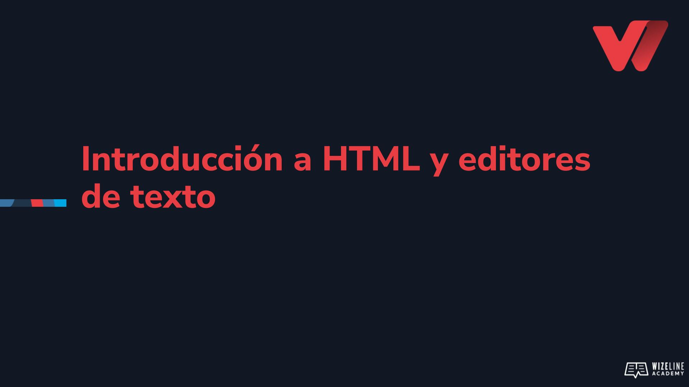

## :tv: Video

  

## :clipboard: Recursos de la lección

- [Editores de texto](editores-de-texto.md)
- [Código](https://github.com/wizelineacademy/web-development-bootcamp-project/tree/pre-curso/sesion_2.1.1/pre-curso/tribute-page)

## :computer: Actividades

- [ ] Elige el tema sobre el que trabajaras tu página tributo.
- [ ] Instala [Sublime Text](https://www.sublimetext.com/)
- [ ] Crea la carpeta `web-development-bootcamp`, que es donde guardaremos los archivos del curso.
- [ ] Dentro de la carpeta `web-development-bootcamp` crea la carpeta `mi-primera-pagina`.
- [ ] Utilizando Sublime Text crea un nuevo archivo y coloca en él la estructura básica de un sitio HTML 5.
- [ ] Guarda el archivo dentro de la carpeta `mi-primera-pagina` con el nombre `index.html`.
- [ ] Abre el archivo con diferentes editores de texto (bloc de notas, Word, etc.).

## :books: Para aprender más

- [Elementos de HTML5](https://www.w3docs.com/snippets/html/html5-page-structure.html )
- [Vim 9.0](https://www.genbeta.com/desarrollo/version-9-0-vim-historico-editor-texto-ahora-incorpora-lenguaje-scripting-1000-veces-rapido)
- [Crear archivos y carpetas utilizando la terminal](crear-archivos-y-carpetas-usando-la-terminal.md)

### 📝 Presentacion

[Introduccion a HTML y editores de texto [Para aprender más]](https://docs.google.com/presentation/d/1-3hgEvfSAOsAvcmPQACAdLcNTL5E2Oyo2J3sJVv197k/edit?usp=sharing)

### :computer: Actividades

- [ ] Utilizando la terminal crea la carpeta `web-development-bootcamp-terminal`.
- [ ] Dentro de ella, utilizando la terminal, crea el archivo `index.html`
- [ ] Si estás en Linux o Mac modifica el archivo `index.html`, utilizando vim o nano, para que contenga la estructura básica de un sitio HTML5
