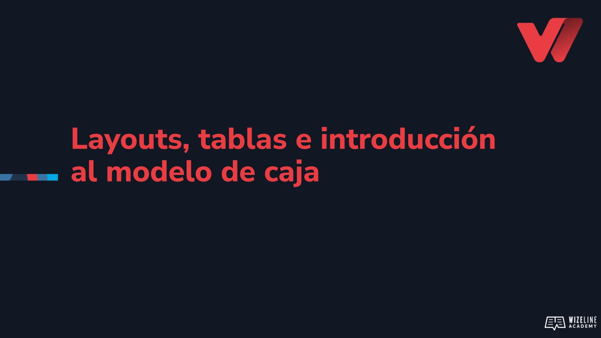

## :tv: Presentación

  

## :clipboard: Recursos de la lección

- [Código](https://github.com/wizelineacademy/web-development-bootcamp-project/tree/pre-curso/sesion_2.1.3/pre-curso/tribute-page)
- [Diagrams.net](https://app.diagrams.net)

## :computer: Actividades

- [ ] Genera el template de la página utilizando una tabla
  - [ ] En la fila que contendrá el contenido de la página realiza los ajustes pertinentes para que luzca como nuestro wireframe (Hint: puedes usar width con porcentajes para lograrlo)
- [ ] Genera el template de la página utilizando divs
  - [ ] En la fila que contendrá el contenido de la página realiza los ajustes pertinentes para que luzca como nuestro wireframe (Hint: puedes usar float y  width con porcentajes para lograrlo)
  - [ ] Modifica el template reemplazando el tercer div (div vacío) dentro de la sección de contenido y utiliza margin o padding para lograr el mismo efecto
  - [ ] Modifica el realizando los cambios correspondientes al template para reemplazar la propiedad float con el atributo display

## :books: Para aprender más

- [Box model](https://www.w3schools.com/css/css_boxmodel.asp)
- [Propiedad _display_](https://www.w3schools.com/css/css_display_visibility.asp)
- [Tablas](https://developer.mozilla.org/es/docs/Learn/HTML/Tables)
