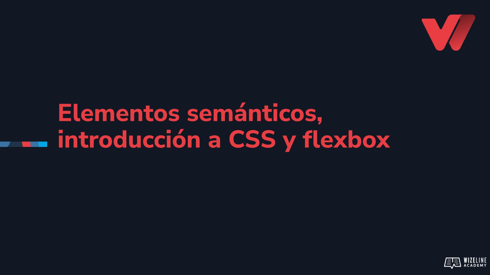

## :tv: Presentación

  

## :clipboard: Recursos de la lección

- [Código](https://github.com/wizelineacademy/web-development-bootcamp-project/tree/pre-curso/sesion_2.1.4/pre-curso/tribute-page)

## :computer: Actividades

- [ ] Remplaza los divs del layout por elementos semánticos
- [ ] Utiliza las propiedades de flexbox para el layout de la página
- [ ] Añade contneido al `header`
- [ ] Utiliza las propiedades de flexbox para mostrar el `footer` en la parte baja de la página
- [ ] Remueve los margenes del elemento `body` para que el contenido abarque toda la ventana del navegador.
- [ ] Practica tus habilidades de flexbox con los siguientes juegos:
  - [Flexbox Froggy](https://flexboxfroggy.com/)
  - [Flexbox Zombies](https://mastery.games/flexboxzombies/chapter/1/level/1)

## :books: Para aprender más

- [Elementos semánticos](https://www.w3schools.com/html/html5_semantic_elements.asp)
- [Aprender CSS](https://www.w3docs.com/learn-css.html)
- [Flexbox](https://developer.mozilla.org/en-US/docs/Learn/CSS/CSS_layout/Flexbox)
- [Guía de Flexbox](https://css-tricks.com/snippets/css/a-guide-to-flexbox/)
- [Conceptos de Flexbox](https://developer.mozilla.org/en-US/docs/Web/CSS/CSS_Flexible_Box_Layout/Basic_Concepts_of_Flexbox)
