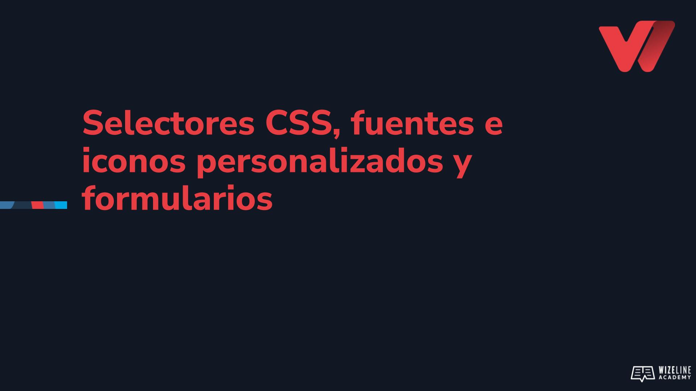

## :tv: Presentación

<div align="center">
  <a target="_blank" href="https://docs.google.com/presentation/d/1Z3ILwH_7yRpZA87tKJHjRDnmJXIInsPfrHNbWKgD5X0/edit?usp=sharing"></a>
</div>

## :clipboard: Recursos de la lección

- [Código](https://github.com/wizelineacademy/web-development-bootcamp-project/tree/pre-curso/sesion_2.1.5/pre-curso/tribute-page)
- [Seleccionador de color de Google](https://www.google.com/search?client=firefox-b-d&q=hexadecimal+color+picker )
- [Lineicons](https://lineicons.com/)
- [Google Fonts](https://fonts.google.com/)

## :computer: Actividades

- [ ] Asigna los ids correspondientes a los siguientes elementos:
  - `<header>` -> `#header`
  - `<div>` -> `#main-content-container`
  - `<aside>` -> `#links-sidebar`
  - `<section>` -> `#main-content`
  - `<footer>` -> `#footer`
- [ ] Reemplaza el selector de elemento por el id en los estilos
- [ ] Extrae los estilos inline de article y section,  y colócalos dentro de lo estilos internos
- [ ] Selecciona un color de fondo y añadelo dentro de los estilos del elemento `<body>`
- [ ] Selecciona un color de texto y añadelo dentro de los estilos del elemento `<body>`
- [ ] Agrega una imagen con 100% de ancho como primer elemento dentro de nuestro sección  `main-content`, agregandole una clase
- [ ] Añade al menos dos secciones con encabezados y párrafos dentro de `#main-content`
- [ ] Remueve la propiedad background: yellowgreen; de los estilos de `#main-content`
- [ ] Selecciona un color de fondo, diferente al del body, y asignaselo como background a tu #footer
- [ ] Convierte el elemento `#footer` en un elemento flexbox
- [ ] Añade tres secciones (divs) al `#footer`, con la clase `.footer__section` y  con sus encabezados correspondientes
- [ ] Crea la clase `.footer__section` con los atributos:
  ```css
      .footer__section {
        flex: 1;
        display: flex;
        align-items: center;
        flex-direction: column;
      }
    ```
- [ ] Selecciona una fuente de Google Fonts y añádela como fuente de texto principal
- [ ] Añade al menos dos elementos de redes sociales en el bloque `.social__networks` del #footer
- [ ] Utiliza la clase `.social__icon` para dar estilos a los iconos
- [ ] Utiliza la clase `.social__icon-handler` para dar estilos al texto que acompaña a la red social
- [ ] Añade vínculos al handler de la red social para que te rediriga a ella
- [ ] Añade un formulario en el #footer con un campo para el correo electrónico y un campo para comentarios
- [ ] Utiliza selectores por elemento y atributos para darle estilos a los elementos input (email y submit) y al textarea


## :books: Para aprender más

- [Selectores CSS](https://www.w3schools.com/cssref/css_selectors.asp )
- [Formularios](https://www.w3schools.com/tags/tag_form.asp)
- [CCS3 transiciones](https://www.w3schools.com/css/css3_transitions.asp)
- [Box sizing](https://developer.mozilla.org/en-US/docs/Web/CSS/box-sizing)
- [BEM](http://getbem.com/naming/)
- [Guía de Flexbox](https://css-tricks.com/snippets/css/a-guide-to-flexbox/)
- [Conceptos de Flexbox](https://developer.mozilla.org/en-US/docs/Web/CSS/CSS_Flexible_Box_Layout/Basic_Concepts_of_Flexbox)
