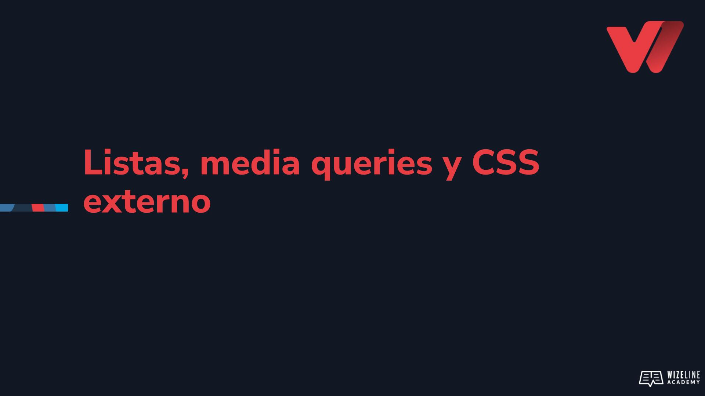

## :tv: Presentación

  

## :clipboard: Recursos de la lección

- [Código](https://github.com/wizelineacademy/web-development-bootcamp-project/tree/pre-curso/sesion_2.1.6/pre-curso/tribute-page)

## :computer: Actividades

- [ ] Crea una nueva página y añade: una lista ordena, una lista desordenada y una lista de descripción.
- [ ] Añade el menú principal a tu página.
- [ ] Añade los estilos correspondientes dentro de la media query para cambiar la forma en que se despliega el menú en dispositivos móviles. 
- [ ] Añade el script correspondiente para hacer el menú responsivo
- [ ] Añade el contenido de la sección “sitios de interés”
- [ ] Utiliza media queries para ocultar la sección “sitios de interés” cuando el ancho de la pantalla sea menor a 600 píxeles.
- [ ] Ajusta el padding de #main-content cuando el ancho de la pantalla sea menor a 600 píxeles.
- [ ] Utiliza media queries para que el contenido del footer se muestre en formato vertical cuando el ancho de la pantalla sea igual o menor a 600 píxeles.
- [ ] Extrae los estilos internos de index.html a un nuevo archivo llamado style.css e importalos dentro de index.html

## :books: Para aprender más

- [Listas](https://www.w3docs.com/learn-html/html-lists.html)
- [Propiedad CSS list-style-type](https://www.w3schools.com/cssref/pr_list-style-type.asp)
- [Propiedad CSS list-style-type todos los estilos](https://www.w3schools.com/cssref/playdemo.asp?filename=playcss_list-style-type&preval=armenian)
- [CCS media queries](https://developer.mozilla.org/es/docs/Web/CSS/Media_Queries/Using_media_queries)