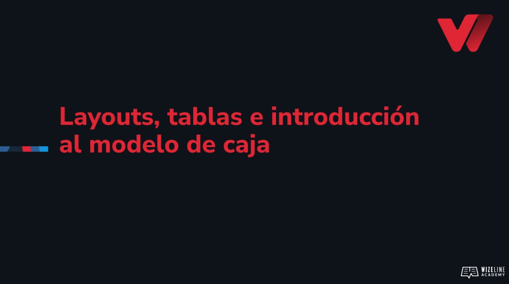

## :tv: Presentación

  

## :clipboard: Recursos de la lección

- [Código](https://github.com/wizelineacademy/web-development-bootcamp-project/tree/pre-curso/sesion_3.1/pre-curso/musical-instrument)

## :computer: Actividades
- [ ] Crea una carpeta con el nombre js-instrument.
- [ ] Abre js-instrument con Visual Studio Code.
- [ ] Crea dos archivos, index.html y styles.css, vincúlalos. 
- [ ] Vincula un archivo llamado main.js a tu archivo HTML, en el, escribe console.log('Hola mundo')

## :books: Para aprender más

- [Cómo vincular un archivo de JS a HTML](https://www.freecodecamp.org/espanol/news/como-enlazar-a-un-documento-javascript-en-html/#:~:text=El%20atributo%20'src'%20en%20una,enlazar%20a%20tu%20documento%20HTML.&text=Esto%20apuntar%C3%ADa%20a%20un%20archivo,el%20mismo%20directorio%20del%20archivo%20.)

- [Documentación de JS](https://developer.mozilla.org/en-US/docs/Web/JavaScript)

