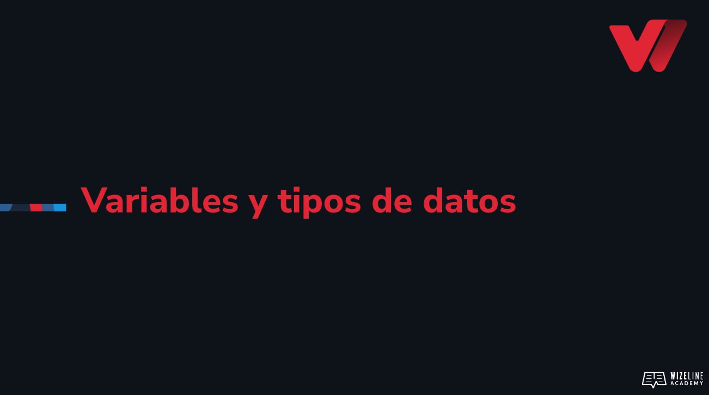

## :tv: Presentación

  

## :clipboard: Recursos de la lección

- [Código](https://github.com/wizelineacademy/web-development-bootcamp-project/tree/pre-curso/sesion_3.2/pre-curso/musical-instrument)

## :computer: Actividades
- [ ] Asigna las variables correspondientes e imprímelas con console.log()
- [ ] Intenta cambiar el nombre de myName. Analiza el error que devuelve.
- [ ] Utiliza typeof y console.log() para revisar el tipo de dato de tus variables. 

## :books: Para aprender más

- [Variables en JS](https://developer.mozilla.org/es/docs/Learn/JavaScript/First_steps/Variables)
- [Tipos de datos y estructuras en JS](https://developer.mozilla.org/es/docs/Web/JavaScript/Data_structures)
- [scope en JS](https://developer.mozilla.org/es/docs/Glossary/Scope)

