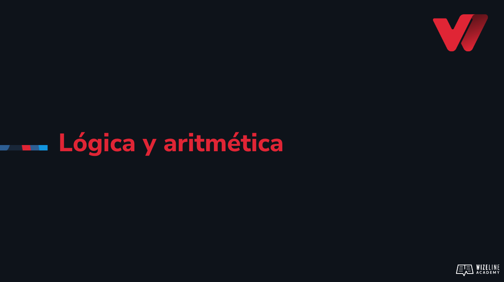

## :tv: Presentación

  

## :clipboard: Recursos de la lección

- [Código](https://github.com/wizelineacademy/web-development-bootcamp-project/tree/pre-curso/sesion_3.3/pre-curso/musical-instrument)

## :computer: Actividades
- [ ] Realiza operaciones matemáticas con las variables X y Y, almacénalos en una variable Z.
- [ ] Verifica el valor de Z utilizando console.log() con cada operación.
- [ ] Utiliza los operadores de comparación entre las variables X y Y.
- [ ] Verifica el resultado de la condición utilizando console.log() con cada operación.
- [ ] Realiza una condicional con la variable likesMusic, si su contenido es true, imprime en consola 'Me gusta la música', de lo contrario, imprime 'No me gusta la música'.
- [ ] Refactoriza el código anterior para utilizar el operador lógico OR (||). Utiliza console.log() para mostrar en consola la cantidad.
- [ ] En el código anterior hay un bug con nuestra variable dinero relacionado al scope, corrígelo. 
- [ ] Prueba a dar diferentes valores a tus variables.
- [ ] Ahora, para poder otorgarle $20 a tu hermanito, debe barrer el piso Y realizar la compra, de lo contrario no le darás nada. Codifica la condicional correspondiente.

## :books: Para aprender más

- [Operadores en JS](https://developer.mozilla.org/es/docs/Web/JavaScript/Guide/Expressions_and_Operators)
- [Condicionales en JS](https://developer.mozilla.org/es/docs/Learn/JavaScript/Building_blocks/conditionals)
- [scope en JS](https://developer.mozilla.org/es/docs/Glossary/Scope)

