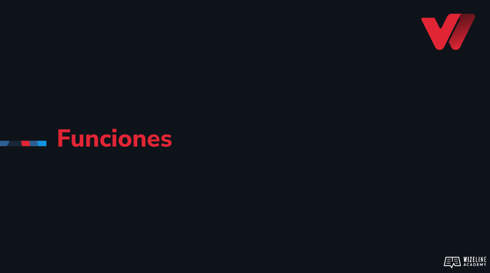

## :tv: Presentación

<div align="center">
  <a target="_blank" href="https://docs.google.com/presentation/d/1DCtEmYiFl_w2x_0RSbhHZ5boiTKH25UbzPmESyxe-zk/edit?usp=sharing"></a>
</div>

## :clipboard: Recursos de la lección

- [Código](https://github.com/wizelineacademy/web-development-bootcamp-project/tree/pre-curso/sesion_3.4/pre-curso/musical-instrument)


## :computer: Actividades
- [ ] Copia y pega el maquetado de tu piano, modifica los estilos que desees.
- [ ] Crea una función llamada aCelsius(fahrenheit). Recibirá como parámetro un número, transformará los grados de fahrenheit a Celsius.
- [ ] Refactoriza tu función aCelsius para que sea utilizada como función de flecha.
- [ ] Verifica el resultado de la condición utilizando console.log() con cada operación.
- [ ] Junto a tu mentor, comienza a crear pseudocódigo de una función vacía llamada tocarNota(), esta se encargará de reproducir las notas de nuestro piano.
- [ ] Copia y pega las siguientes líneas en tu código (Contexto global).

```
const keys = document.querySelectorAll('.key');
const whiteKeys = document.querySelectorAll('.key.white');
const blackKeys = document.querySelectorAll('.key.black');
```


## :books: Para aprender más

- [Funciones en JS](https://developer.mozilla.org/en-MX/docs/Web/JavaScript/Guide/Functions)
- [Arrow functions](https://developer.mozilla.org/en-MX/docs/Web/JavaScript/Reference/Functions/Arrow_functions)
- [Callbacks](https://developer.mozilla.org/en-MX/docs/Glossary/Callback_function)


