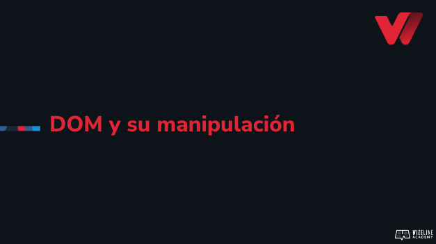

## :tv: Presentación

<div align="center">
  <a target="_blank" href="https://docs.google.com/presentation/d/1JJaRkiH8yPvaJfBp0mUJLyDentGTf-oNbCz_pl8QNGk/edit?usp=sharing"></a>
</div>

## :clipboard: Recursos de la lección

- [Código](https://github.com/wizelineacademy/web-development-bootcamp-project/tree/pre-curso/sesion_3.5/pre-curso/musical-instrument)


## :computer: Actividades
- [ ] Guarda en variables el resultado de buscar los elementos con los id name y age.
- [ ] Junto a tu mentor, modifica la función playNote() y añade una variable llamada noteAudio, el resultado de usar el querySelector getElementByID(), enviándole como parámetro el atributo key.dataset.note de la función.
- [ ] Utiliza el método play() de noteAudio.
- [ ] Agrega el contenido de las variables myAge y myName a los elementos correspondientes.
- [ ] Añade un nuevo nodo a tu documento.
- [ ] Ahora elimínalo.
- [ ] Añade un manejador de evento al presionar una tecla (keydown). Cada que se presione una tecla, emite un alert con cualquier texto.
- [ ] Comenta el alert y coloca el siguiente código:

```
document.addEventListener('keydown', (e) => {
  if (e.repeat) return;
  const key = e.key;
  const whiteKeyIndex = WHITE_KEYS.indexOf(key);
  const blackKeyIndex = BLACK_KEYS.indexOf(key);

  if (whiteKeyIndex > -1) playNote(whiteKeys[whiteKeyIndex]);
  if (blackKeyIndex > -1) playNote(blackKeys[blackKeyIndex]);
});
```

- [ ] Pega el siguiente código en tu archivo javascript.
 ```
const WHITE_KEYS = ['z', 'x', 'c', 'v', 'b', 'n', 'm'];
const BLACK_KEYS = ['s', 'd', 'g', 'h', 'j'];
```


## :books: Para aprender más

- [DOM](https://developer.mozilla.org/en-US/docs/Web/API/Document_Object_Model)
- [Manipulating DOM](https://developer.mozilla.org/en-US/docs/Learn/JavaScript/Client-side_web_APIs/Manipulating_documents)
- [Selectores](https://developer.mozilla.org/en-US/docs/Web/API/Document_object_model/Locating_DOM_elements_using_selectors)
- [Eventos](https://developer.mozilla.org/en-US/docs/Web/Events)


