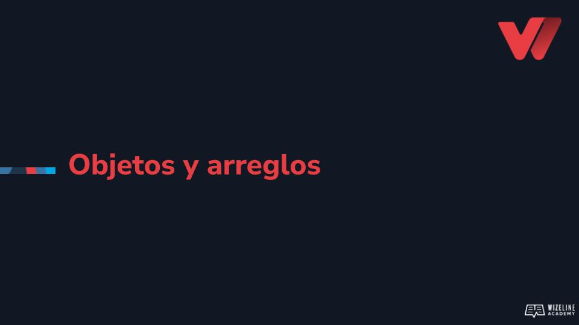

## :tv: Presentación

  

## :clipboard: Recursos de la lección

- [Código](https://github.com/wizelineacademy/web-development-bootcamp-project/tree/pre-curso/sesion_3.6/pre-curso/musical-instrument)

## :computer: Actividades
- [ ] Crea tu primer objeto, puedes basarte en el objeto persona de los ejemplos. Utiliza tu propia información para definir los atributos y métodos correspondientes.
- [ ] Crea un arreglo llamado frutas. Inicialízalo con 5 frutas de tu preferencia.
- [ ] Añade una piña en la posición número 5. 
- [ ] Renombra tu primera fruta como Higo.
- [ ] Utiliza push para añadir una frambuesa.
- [ ] Utiliza shift para eliminar la primera fruta.
- [ ] Puedes utilizar console.log() Para verificar los cambios en tu arreglo

## :books: Para aprender más

- [Arrays](https://developer.mozilla.org/en-US/docs/Learn/JavaScript/First_steps/Arrays)
- [Objetos](https://developer.mozilla.org/en-US/docs/Web/JavaScript/Reference/Global_Objects/Object)