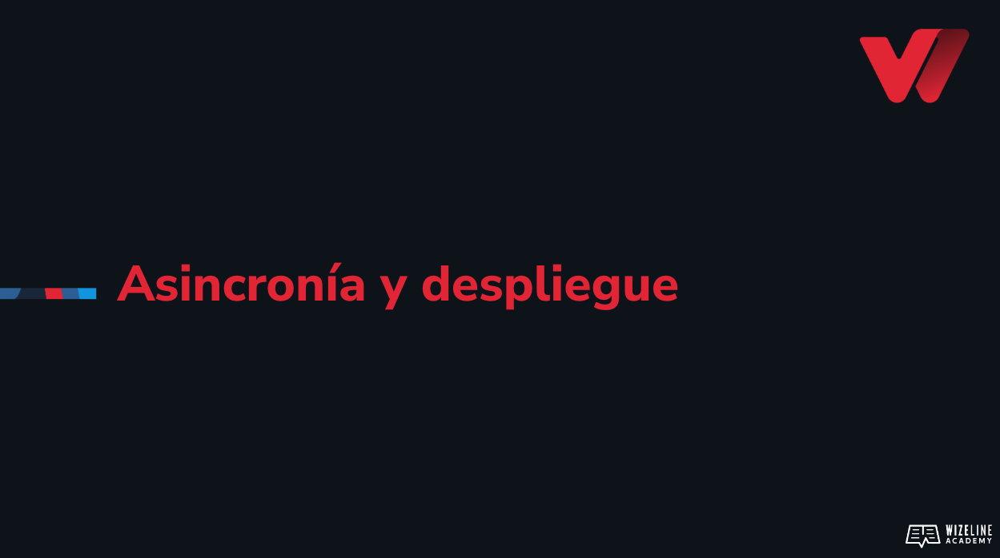

## :tv: Presentación

  

## :clipboard: Recursos de la lección

- [Código](https://github.com/wizelineacademy/web-development-bootcamp-project/tree/pre-curso/sesion_3.7/pre-curso/musical-instrument)

## :computer: Actividades
- [ ] Crea una función callback para que, mediante una condicional, decidir si la respuesta es correcta y modifica tu elemento con id GuessedAge.
- [ ] Utiliza callbacks, promesas y async/await para realizar diferentes versiones de tu llamada al servidor.
- [ ] Despliega tu sitio en github pages

## :books: Para aprender más

- [Asincronismo](https://developer.mozilla.org/en-US/docs/Learn/JavaScript/Asynchronous)
- [Promesas](https://developer.mozilla.org/en-US/docs/Learn/JavaScript/Asynchronous/Promises)
- [Async/Await](https://developer.mozilla.org/en-US/docs/Web/JavaScript/Reference/Statements/async_function)
- [The event loop](https://medium.com/@Rahulx1/understanding-event-loop-call-stack-event-job-queue-in-javascript-63dcd2c71ecd)
- [Desplegando con github pages](https://docs.github.com/en/pages/getting-started-with-github-pages/configuring-a-publishing-source-for-your-github-pages-site)